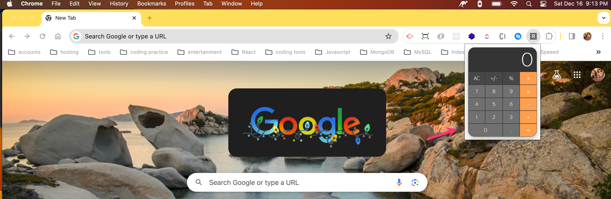

# MacOS calculator application clone

## Description
A MacOS calculator app clone, bundled as a Google Chrome extension!

This extension is built with Typescript, and React.js.

## Table of Contents
* [Installation](#installation)
* [Usage](#usage)
* [Scripts](#scripts)
* [Questions](#questions)
* [Resources](#resources)

## Installation
1. From GitHub, fork the repository. 
2. Then, from the `react-chrome-ext` Folder, run `npm install` for the front end packages.
3. From there, run `npm run build` to build the latest version of the extension.
4. Run `npm start` from the root directory, on your local machine to run the code locally.

To run the Chrome extension:
1. Visit chrome://extensions/ in your browser.
2. Toggle on `Developer mode`.
3. Click `Load unpacked` button in the top left corner.
4. Select the `dist` Folder inside of the `react-chrome-ext` project folder.

## Usage
* **Install in Google Chrome!**  

## Scripts
In the project directory, you can run:

### `npm start`

Runs the app in the development mode.\
Open [http://localhost:3000](http://localhost:3000) to view it in the browser.

The page will reload if you make edits.\
You will also see any lint errors in the console.

### `npm run build`

Builds the app for production to the `build` folder.\
It correctly bundles React in production mode and optimizes the build for the best performance.

See the section about [deployment](https://facebook.github.io/create-react-app/docs/deployment) for more information.

## Questions
**[Contact me](https://sleepy-reaches-69699.herokuapp.com/)**

## Resources
[Medium: Creating a Chrome Extension with React: A Step-by-Step Guide](https://medium.com/@tharshita13/creating-a-chrome-extension-with-react-a-step-by-step-guide-47fe9bab24a1)
[Udemy: Typescript: The Complete Developer's Guide](https://www.udemy.com/course/typescript-the-complete-developers-guide/learn/lecture/14504488#overview)
